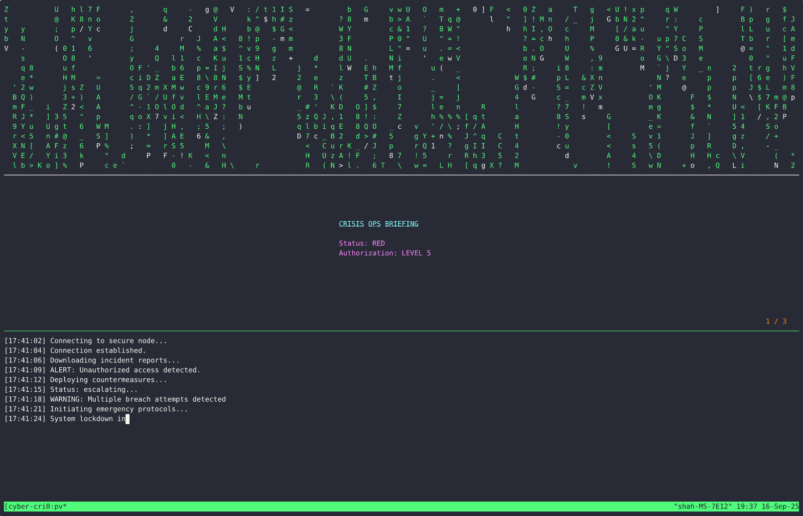

Old school hacky slide show for crisis simulations.

Slides are displayed using `mdp` with accompanying terminal effects for that hacker aesthetic.




## Usage

```bash
./crisis.sh
```

Requires: `mdp`, `tmux`, `cmatrix`, `pv`
